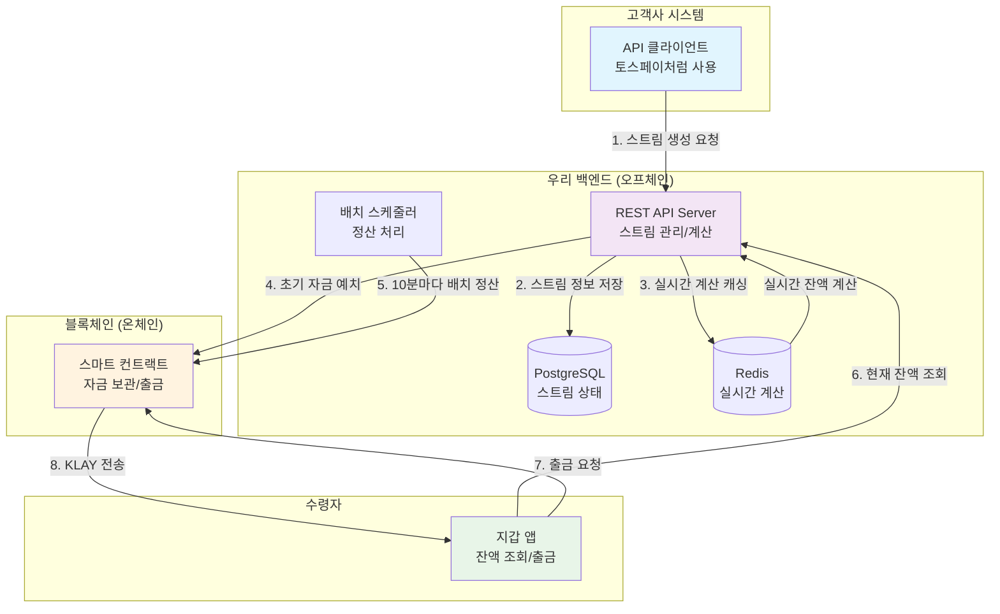

# 머니 스트리밍 API 모듈


## 프로젝트 개요

### 목표
**토스페이/아임포트 같은 결제 API의 블록체인 버전**을 만드는 것
- 고객사가 복잡한 블록체인 지식 없이도 "머니 스트리밍" 기능을 API로 쉽게 붙일 수 있는 모듈
- **Superfluid를 모티브로 삼은 자체 머니 스트리밍 프로토콜** 구현

### 비즈니스 모델
- **계약건별 수수료**: 계약 생성당 0.5% + 고정비
- **API 이용료**: Basic/Pro/Enterprise 플랜

### 어떻게 할까..
- **백엔드**: 핵심 API 모듈만 구현 (복잡한 마이크로서비스 X)
- **프론트엔드**: 데모용 대시보드 (간단하게)
- **스마트 컨트랙트**: 최소한의 컨트랙트

---

## 핵심 개념 이해

### 머니 스트리밍이란?

**전통적인 계약 방식의 문제점:**
- 프로젝트 완료 후 일괄 지급 → 수주업체 자금 부족
- 급여는 월말에만 지급 → 직원들 생활비 부족
- 구독료는 월 선결제 → 실제 사용량과 무관

**머니 스트리밍 해결책:**
- 매초마다 작업한 만큼 돈이 쌓임 → 언제든 출금 가능
- 실제 사용한 만큼만 결제 → 공정한 거래
- 블록체인 기반 → 투명하고 자동화

```
전통적인 방식:
월 1일 ──────────────────── 월 30일 ──────────────────── 다음달 1일
        (작업중... 돈 없음)            (300만원 일시지급)

스트리밍 방식:
월 1일 ●●●●●●●●●●●●●●●●●●●●●●●●●●●●●● 월 30일
      ↓ ↓ ↓ ↓ ↓ ↓ ↓ ↓ ↓ ↓ ↓ ↓ ↓ ↓ ↓ ↓
      매초 10원씩 자동 적립 → 언제든 출금 가능
```

### 용어 정리 (쉽게 이해하기)

| 용어 | 쉬운 설명 | 실생활 예시 |
|------|-----------|-------------|
| **Flow Rate<br/>(흐름 속도)** | 1초마다 얼마씩 돈이 흐를지 정하는 속도<br/>• 계산: 총 금액 ÷ 총 기간(초) | • 월 300만원 급여 = 초당 1.16원<br/>• 90일 900만원 프로젝트 = 초당 1.16원<br/>• 1 KLAY = 10¹⁸ wei (매우 작은 단위) |
| **Stream<br/>(돈의 흐름)** | 송금자에서 수령자로 지속적으로 흐르는 돈의 강물<br/>• 시작/끝 시점 설정 가능<br/>• 중간에 일시정지/재개 가능 | • 회사 → 직원 (급여 스트림)<br/>• 클라이언트 → 개발자 (프로젝트 스트림)<br/>• 구독자 → 크리에이터 (후원 스트림) |
| **Deposit<br/>(예치금)** | 스트림을 시작하기 위해 미리 맡겨두는 돈<br/>• 총 지급할 금액 + 플랫폼 수수료 0.5%<br/>• 한번 예치하면 자동으로 흘러감 | • 3개월 급여 스트림 → 900만원 + 수수료<br/>• 부족하면 스트림 자동 중단<br/>• 남은 금액은 나중에 회수 가능 |
| **Settlement<br/>(정산/출금)** | 지금까지 쌓인 돈을 실제로 내 지갑으로 빼는 것<br/>• 언제든 가능 (24시간)<br/>• 가스비만 내면 즉시 출금 | • 10일 일한 급여 = 100만원 출금<br/>• 50% 완성된 프로젝트 = 450만원 출금<br/>• 1주일 구독료 = 7만원 출금 |
| **Buffer<br/>(안전장치)** | 스트림이 갑자기 중단되지 않도록 여유분<br/>• 보통 7일치 정도<br/>• 예치금 부족할 때 경고 역할 | • 월급 300만원이면 70만원 정도 여유분<br/>• 부족해지면 알림 발송<br/>• 완전 고갈 전에 충전 가능 |

### 실제 사용 시나리오

**시나리오 1: 프리랜서 개발자 천씨 (프로젝트 계약)**
```
1. 클라이언트가 3개월 900만원 웹사이트 개발 프로젝트 의뢰
2. 스마트 컨트랙트에 904.5만원 예치 (수수료 0.5% 포함)
3. 매초마다 1.16원씩 김씨 계좌에 자동 적립
4. 김씨는 1주일 후 21만원, 1달 후 300만원 출금 가능
5. 프로젝트 완료시 자동으로 모든 돈 지급 완료
```

**시나리오 2: 스타트업 직원 진씨 (실시간 급여)**
```
1. 회사가 월 300만원 급여 스트림 설정
2. 매월 초 300.15만원 예치 (수수료 포함)
3. 이씨는 매일 10만원씩 쌓이는 돈 확인 가능
4. 급한 일 있으면 15일 차에 150만원 미리 출금
5. 월말까지 기다릴 필요 없이 실시간 급여 생활
```

**시나리오 3: 유튜버 이씨 (크리에이터 후원)**
```
1. 구독자 1000명이 각자 월 1만원씩 후원 설정
2. 총 1000만원이 스마트 컨트랙트에 예치됨
3. 박씨는 매일 33만원씩 실시간으로 받음
4. 좋은 영상 올리면 추가 후원자 유입으로 일일 수입 증가
5. 구독자가 줄어들면 자동으로 스트림 금액도 감소
```

**시나리오 4: 넷플릭스 결 대리 (구독 서비스)**
```
1. 사용자가 한국 넷플릭스 구독 (월 17,000원)
2. 17,850원 예치 (수수료 포함), 매초 6.5원씩 차감
3. 사용자가 실제 시청한 시간만큼만 결제
4. 15일 동안 10시간만 봤다면 8,500원만 차감
5. 남은 9,350원은 다음달로 이월 또는 환불
```

**시나리오 5: 스타트업 투자자 최씨 (배당 분배)**
```
1. 스타트업이 월 매출 1억원 중 10%를 투자자들에게 배당
2. 최씨 지분 5% → 월 50만원 배당 받을 예정
3. 회사 매출이 실시간으로 들어올 때마다 즉시 배당 지급
4. 매출 좋은 날엔 일 3만원, 안 좋은 날엔 1만원 등 변동
5. 월말 정산 없이 실시간으로 수익 배분 받음
```

**시나리오 6: 배달 라이더 정씨 (시간당 임금)**
```
1. 배달 회사가 시간당 15,000원 스트림 설정
2. 정씨가 앱에서 "근무 시작" 버튼 누르면 스트림 활성화
3. 1시간 일하면 15,000원, 4시간 일하면 6만원 자동 적립
4. 하루 종료 후 바로 당일 임금 출금 가능
5. 주말/야간 수당도 실시간으로 다른 스트림 속도로 적용
```

**시나리오 7: SaaS 회사 (사용량 기반 과금)**
```
1. 클라우드 서비스 사용자가 월 100만원 예치
2. API 호출 1회당 10원, DB 저장 1GB당 500원씩 차감
3. 사용량이 많은 날엔 5만원, 적은 날엔 1만원 차감
4. 잔액 부족하면 자동 알림, 서비스 중단 전 충전 유도
5. 실제 사용한 만큼만 정확하게 과금
```

### 주요 사용 사례

1. **프로젝트 계약**: 개발/디자인 프로젝트 진행도별 대금 지급
2. **구독 서비스**: 사용량 기반 실시간 과금
3. **급여 시스템**: 실시간 급여 (우리 모듈의 한 가지 활용법)
4. **투자 배당**: 수익 발생시 실시간 배분
5. **크리에이터 후원**: 콘텐츠 소비량별 실시간 정산

---

## Architecture 설계

### 시스템 아키텍처 (오프체인 + 온체인)



### 백엔드 vs 스마트 컨트랙트 역할 분담

| 구분 | 백엔드 (오프체인) | 스마트 컨트랙트 (온체인) |
|------|------------------|-------------------------|
| **주요 역할** | • 스트림 관리 및 실시간 계산<br/>• API 제공 및 인증<br/>• 복잡한 비즈니스 로직 처리 | • 자금 보관 및 출금<br/>• 최종 정산 및 배치 처리<br/>• 탈중앙화된 신뢰 보장 |
| **처리하는 데이터** | • 스트림 생성/수정/삭제<br/>• 실시간 잔액 계산<br/>• 사용자 인증 및 권한 관리 | • 예치금 관리<br/>• 출금 처리<br/>• 배치 정산 기록 |
| **업데이트 빈도** | • 실시간 (매초)<br/>• API 호출시마다 | • 배치 (10분마다)<br/>• 출금 요청시에만 |
| **장점** | • 빠른 응답 속도<br/>• 복잡한 로직 처리 가능<br/>• 가스비 없음 | • 신뢰성 보장<br/>• 탈중앙화<br/>• 검증 가능 |
| **단점** | • 중앙화된 신뢰 필요<br/>• 서버 다운 위험 | • 가스비 발생<br/>• 느린 처리 속도 |

### 오프체인 처리 방식 

**1. 실시간 계산은 백엔드에서**
```javascript
// 매초마다 Redis에서 실시간 계산을 한다던지..?
function calculateCurrentBalance(streamId) {
  const stream = getStreamFromCache(streamId);
  const currentTime = Date.now();
  const elapsedSeconds = (currentTime - stream.lastUpdate) / 1000;
  const additionalAmount = stream.flowRate * elapsedSeconds;
  
  return stream.lastBalance + additionalAmount;
}
```

**2. 배치로 블록체인 정산**
```javascript
// 10분마다 실행되는 배치 작업
async function batchSettlement() {
  const activeStreams = await getActiveStreams();
  
  for (const stream of activeStreams) {
    const calculatedBalance = calculateCurrentBalance(stream.id);
    
    // 블록체인에 배치로 업데이트
    await contract.updateStreamBalance(
      stream.externalId, 
      calculatedBalance
    );
  }
}
```

**3. 사용자는 언제든 출금 가능**
```javascript
// 사용자가 출금 버튼 클릭시
async function withdraw(userWallet) {
  // 1. 백엔드에서 현재 출금 가능 금액 계산
  const withdrawableAmount = await calculateWithdrawableAmount(userWallet);
  
  // 2. 스마트 컨트랙트에서 즉시 출금 처리
  await contract.withdraw(userWallet, withdrawableAmount);
}
```

## DB

### PostgreSQL 스키마

```sql
-- 고객사 테이블
CREATE TABLE companies (
    id UUID PRIMARY KEY DEFAULT gen_random_uuid(),
    name VARCHAR(255) NOT NULL,
    email VARCHAR(255) UNIQUE NOT NULL,
    api_key VARCHAR(64) UNIQUE NOT NULL,
    api_secret_hash VARCHAR(255) NOT NULL,
    tier VARCHAR(20) DEFAULT 'basic', -- basic, pro, enterprise
    created_at TIMESTAMP DEFAULT NOW()
);

-- 스트림 테이블
CREATE TABLE streams (
    id UUID PRIMARY KEY DEFAULT gen_random_uuid(),
    external_id VARCHAR(255) NOT NULL, -- 고객사에서 제공하는 ID
    company_id UUID NOT NULL REFERENCES companies(id),
    
    -- 기본 정보
    sender_wallet VARCHAR(42) NOT NULL,
    receiver_wallet VARCHAR(42) NOT NULL,
    token_address VARCHAR(42) NOT NULL,
    flow_rate DECIMAL(78,0) NOT NULL, -- wei per second
    
    -- 상태
    status VARCHAR(20) DEFAULT 'created', -- created, active, paused, closed, failed
    blockchain_tx_hash VARCHAR(66),
    
    -- 메타데이터
    display_name VARCHAR(255),
    description TEXT,
    stream_type VARCHAR(20) DEFAULT 'project', -- project, salary, subscription, dividend, donation
    tags JSONB,
    
    -- 시간
    start_time TIMESTAMP,
    end_time TIMESTAMP,
    created_at TIMESTAMP DEFAULT NOW(),
    updated_at TIMESTAMP DEFAULT NOW(),
    
    UNIQUE(company_id, external_id)
);

-- 블록체인 트랜잭션 로그
CREATE TABLE blockchain_transactions (
    id UUID PRIMARY KEY DEFAULT gen_random_uuid(),
    stream_id UUID REFERENCES streams(id),
    tx_hash VARCHAR(66) NOT NULL,
    tx_type VARCHAR(50) NOT NULL, -- create_stream, close_stream, pause_stream
    status VARCHAR(20) DEFAULT 'pending', -- pending, confirmed, failed
    gas_used BIGINT,
    created_at TIMESTAMP DEFAULT NOW()
);

-- 계약별 수수료 기록
CREATE TABLE contract_fees (
    id UUID PRIMARY KEY DEFAULT gen_random_uuid(),
    company_id UUID NOT NULL REFERENCES companies(id),
    stream_id UUID NOT NULL REFERENCES streams(id),
    contract_amount DECIMAL(20,2) NOT NULL,
    platform_fee DECIMAL(10,2) NOT NULL,
    fee_rate DECIMAL(5,4) NOT NULL,
    created_at TIMESTAMP DEFAULT NOW()
);
```

---

## API 명세 (상세 설명)

### 백엔드 API가 필요한 이유

**1. 블록체인의 한계 극복**
- 스마트 컨트랙트는 복잡한 비즈니스 로직 처리 어려움
- 가스비 때문에 실시간 업데이트 불가능
- 사용자 인증, 권한 관리 등 웹2 기능 필요

**2. 사용자 경험 개선**  
- 빠른 API 응답 (블록체인 대기시간 없음)
- 실시간 계산 결과 제공
- 토스페이/아임포트와 유사한 개발자 경험

**3. 비즈니스 확장성**
- 다양한 스트림 타입 지원
- 복잡한 수수료 정책 적용
- 고객사별 맞춤 기능 제공

### 주요 API 상세 명세

#### 1. 스트림 생성 API

```http
POST /api/v1/streams
Authorization: Bearer {company_api_key}
Content-Type: application/json
```

**목적**: 새로운 머니 스트림을 생성하고 블록체인에 자금을 예치

**처리 과정**:
1. API 키 검증 및 회사 정보 확인
2. 스트림 정보 DB 저장 (PostgreSQL)
3. 실시간 계산용 캐시 설정 (Redis)
4. 블록체인에 자금 예치 트랜잭션 실행
5. 웹훅 이벤트 발송

**Request Body:**
```json
{
  "external_id": "project_alpha_2024_01",      // 고객사에서 관리하는 고유 ID
  "sender_wallet": "0x1234...12345678",        // 자금 송금자 지갑 주소
  "receiver_wallet": "0xfedcba...fedcba09",    // 자금 수령자 지갑 주소  
  "duration": 7776000,                         // 스트림 지속 시간 (초단위, 90일)
  "flow_rate_per_day": "100000000000000000000000", // 일일 스트리밍 금액 (wei)
  "stream_type": "project",                    // 스트림 유형
  "display_name": "알파 프로젝트 개발비",         // 화면 표시명
  "description": "2024년 알파 프로젝트 개발 계약", // 상세 설명
  "start_time": "2024-02-01T00:00:00Z",        // 스트림 시작 시각
  "end_time": "2024-04-30T23:59:59Z",          // 스트림 종료 시각 (옵션)
  "webhook_url": "https://client.com/webhook"   // 상태 변경 알림 URL (옵션)
}
```

**Response:**
```json
{
  "success": true,
  "data": {
    "stream_id": "550e8400-e29b-41d4-a716-446655440000",
    "external_id": "project_alpha_2024_01",
    "status": "created",                        // created -> pending -> active
    "flow_rate_per_second": "1157407407407",   // 초당 스트리밍 금액 (wei)
    "total_amount": "9000000000000000000000000", // 실제 예치 금액
    "contract_fee": "45000000000000000000000",   // 플랫폼 수수료 (0.5%)
    "estimated_gas_fee": "50000000000000000",    // 예상 가스비
    "blockchain_tx_hash": null,                  // 블록체인 트랜잭션 해시 (pending시 null)
    "created_at": "2024-01-15T14:30:00Z",
    "estimated_completion": "2024-01-15T14:32:00Z" // 블록체인 처리 완료 예상 시간
  },
  "message": "스트림 생성 요청이 처리되었습니다. 블록체인 트랜잭션 완료까지 약 2분 소요됩니다."
}
```

**에러 응답:**
```json
{
  "success": false,
  "error": {
    "code": "INSUFFICIENT_BALANCE",
    "message": "송금자 지갑의 잔액이 부족합니다.",
    "details": {
      "required_amount": "9045000000000000000000000",
      "current_balance": "5000000000000000000000000"
    }
  }
}
```

#### 2. 실시간 스트림 상태 조회 API

```http
GET /api/v1/streams/{stream_id}
Authorization: Bearer {company_api_key}
```

**목적**: 스트림의 현재 상태와 실시간 계산된 잔액 정보 조회

**처리 과정**:
1. Redis 캐시에서 실시간 잔액 계산
2. DB에서 스트림 기본 정보 조회  
3. 블록체인 동기화 상태 확인
4. 통합된 응답 데이터 반환

**Response:**
```json
{
  "success": true,
  "data": {
    "stream_id": "550e8400-e29b-41d4-a716-446655440000",
    "external_id": "project_alpha_2024_01", 
    "status": "active",                         // active: 정상 스트리밍 중
    "stream_type": "project",
    "sender_wallet": "0x1234...",
    "receiver_wallet": "0xfedcba...",
    "flow_rate_per_second": "1157407407407",
    
    // 실시간 계산 데이터 (백엔드에서 매초 계산)
    "current_balance": {
      "total_streamed": "1500000000000000000000",    // 생성부터 현재까지 누적 금액
      "withdrawable_now": "1500000000000000000000",  // 지금 출금 가능한 금액
      "remaining_deposit": "7500000000000000000000000", // 예치금 잔여량
      "last_updated": "2024-01-25T10:30:45Z"         // 마지막 계산 시각
    },
    
    // 시간 정보
    "timeline": {
      "start_time": "2024-02-01T00:00:00Z",
      "end_time": "2024-04-30T23:59:59Z",
      "elapsed_seconds": 2073645,                     // 경과 시간
      "remaining_seconds": 5702355,                   // 남은 시간
      "progress_percentage": 26.67                    // 진행률
    },
    
    // 블록체인 상태
    "blockchain_status": {
      "last_settlement": "2024-01-25T10:20:00Z",     // 마지막 배치 정산 시각
      "next_settlement": "2024-01-25T10:30:00Z",     // 다음 정산 예정 시각  
      "on_chain_balance": "1450000000000000000000",  // 블록체인상 확정 잔액
      "pending_amount": "50000000000000000000"       // 정산 대기 중인 금액
    },
    
    "created_at": "2024-01-15T14:30:00Z",
    "blockchain_tx_hash": "0xabc123def456..."
  }
}
```

#### 3. 스트림 목록 조회 API (페이징)

```http
GET /api/v1/streams?type=project&status=active&limit=20&offset=0&sort=created_at:desc
Authorization: Bearer {company_api_key}
```

**목적**: 회사별 스트림 목록을 필터링/정렬/페이징하여 조회

**Query Parameters:**
- `type`: 스트림 유형 (project, salary, subscription, dividend, donation)
- `status`: 상태 필터 (active, paused, completed, failed)
- `limit`: 페이지 크기 (기본 20, 최대 100)
- `offset`: 페이지 오프셋
- `sort`: 정렬 기준 (created_at, total_amount, status)
- `search`: 검색어 (display_name, external_id에서 검색)

**Response:**
```json
{
  "success": true,
  "data": {
    "streams": [
      {
        "stream_id": "uuid-1",
        "external_id": "project_alpha_2024_01",
        "display_name": "알파 프로젝트 개발비",
        "stream_type": "project",
        "status": "active",
        "sender_wallet": "0x1234...",
        "receiver_wallet": "0xfedcba...", 
        "total_amount": "9000000000000000000000000",
        "current_streamed": "2400000000000000000000000", // 현재까지 스트리밍된 금액
        "progress_percentage": 26.67,
        "created_at": "2024-01-15T14:30:00Z",
        "estimated_completion": "2024-04-30T23:59:59Z"
      }
    ],
    "pagination": {
      "total": 45,           // 전체 스트림 수
      "limit": 20,           // 페이지 크기
      "offset": 0,           // 현재 오프셋  
      "has_next": true,      // 다음 페이지 존재 여부
      "has_prev": false      // 이전 페이지 존재 여부
    },
    "summary": {
      "total_active": 23,    // 활성 스트림 수
      "total_volume": "450000000000000000000000000", // 총 거래량
      "monthly_fee": "2250000000000000000000000"     // 이번달 수수료 수익
    }
  }
}
```

#### 4. 스트림 제어 API

```http
POST /api/v1/streams/{stream_id}/pause
Authorization: Bearer {company_api_key}
Content-Type: application/json
```

**목적**: 활성 스트림을 일시정지하여 자금 흐름 중단

**Request Body:**
```json
{
  "reason": "예산 검토 필요",                    // 일시정지 사유
  "pause_duration": 86400,                      // 일시정지 기간(초, 옵션)
  "auto_resume": true                           // 자동 재개 여부
}
```

**Response:**
```json
{
  "success": true,
  "data": {
    "stream_id": "uuid-here",
    "status": "paused",
    "paused_at": "2024-01-25T15:30:00Z",
    "pause_reason": "예산 검토 필요",
    "streamed_until_pause": "2400000000000000000000000", // 일시정지 시점까지 스트리밍된 금액
    "auto_resume_at": "2024-01-26T15:30:00Z"    // 자동 재개 예정 시각
  },
  "message": "스트림이 일시정지되었습니다. 일시정지 시점까지의 금액은 출금 가능합니다."
}
```

#### 5. 출금 가능 금액 조회 API

```http
GET /api/v1/wallets/{wallet_address}/withdrawable
```

**목적**: 특정 지갑 주소의 총 출금 가능 금액 조회 (여러 스트림 합산)

**Response:**
```json
{
  "success": true,
  "data": {
    "wallet_address": "0xfedcba0987654321fedcba0987654321fedcba09",
    "total_withdrawable": "3500000000000000000000",   // 총 출금 가능 금액
    "streams": [
      {
        "stream_id": "uuid-1",
        "external_id": "project_alpha_2024_01", 
        "stream_type": "project",
        "withdrawable_amount": "1500000000000000000000",
        "last_withdrawal": "2024-01-20T10:00:00Z"
      },
      {
        "stream_id": "uuid-2", 
        "external_id": "salary_jan_2024",
        "stream_type": "salary",
        "withdrawable_amount": "2000000000000000000000",
        "last_withdrawal": "2024-01-24T18:30:00Z"
      }
    ],
    "withdrawal_info": {
      "gas_estimate": "21000",                        // 예상 가스 사용량
      "gas_price": "25000000000",                     // 현재 가스 가격 (wei)
      "estimated_fee": "525000000000000",             // 예상 출금 수수료
      "min_withdrawal": "100000000000000000"          // 최소 출금 금액
    }
  }
}
```

---

## 배포 및 운영

# 일단 온프레미스 배포로 진행

---

## 체크리스트

### MVP (Minimum Viable Product) 기능

#### 백엔드
- [ ] 기본 Nest.js / SpringBoot (Node 기반 백엔드 추천) 서버 셋업
- [ ] PostgreSQL 데이터베이스 연결
- [ ] API 키 인증 미들웨어
- [ ] 스트림 생성/조회/제어 API
- [ ] Kaia 블록체인 연결

#### 스마트 컨트랙트
- [ ] 자체 머니 스트리밍 컨트랙트 작성
- [ ] Hardhat으로 로컬 테스트 작성 및 실행
- [ ] Kaia 테스트넷에 컨트랙트 배포
- [ ] 기본적인 스트림 생성/종료/출금 기능

#### 프론트엔드 (데모용)
- [ ] 다양한 스트림 타입 생성 인터페이스
- [ ] 실시간 스트리밍 현황 대시보드
- [ ] 계약별 수수료 현황

### Demo Day 준비

#### 발표용 시나리오
1. **문제 제시**: 기존 결제/계약의 한계 (완료 후 일괄 지급)
2. **솔루션 소개**: 실시간 머니 스트리밍 API 플랫폼
3. **다양한 활용 사례**: 
   - 프로젝트 진행도별 대금 지급
   - 구독 서비스 사용량 과금
   - 실시간 급여 (우리 모듈의 한 활용법)
   - 크리에이터 후원
4. **라이브 데모**: 
   - 다양한 타입의 스트림 생성
   - 실시간 잔액 변화 보여주기
   - 계약별 수수료 정산
5. **기술적 우수성**: Kaia 기반 자체 스트리밍 프로토콜
6. **비즈니스 모델**: 계약건별 수수료 기반 SaaS

#### 데모용 데이터 준비
```javascript
// scripts/seed-demo-data.js
const demoData = {
  companies: [
    { name: "테크 스타트업", email: "demo@techstartup.com" },
    { name: "크리에이터 플랫폼", email: "demo@creator.com" }
  ],
  streams: [
    {
      external_id: "demo_project_001",
      display_name: "웹사이트 개발 프로젝트", 
      stream_type: "project",
      sender_wallet: "0x...",
      receiver_wallet: "0x...",
      flow_rate_per_day: "100000"
    },
    {
      external_id: "demo_salary_001",
      display_name: "김개발자 실시간 급여", 
      stream_type: "salary",
      sender_wallet: "0x...",
      receiver_wallet: "0x...",
      flow_rate_per_day: "100000"
    }
  ]
};
```

### 추가 구현 가능 기능 (Nice to Have)
- [ ] 이메일/SMS 알림
- [ ] API 사용량 대시보드
- [ ] 스트림 템플릿 기능
- [ ] 다중 토큰 지원
- [ ] 거래 내역 엑셀 다운로드
- [ ] 스트림 타입별 분석 차트

---

**해커톤 화이팅!**
