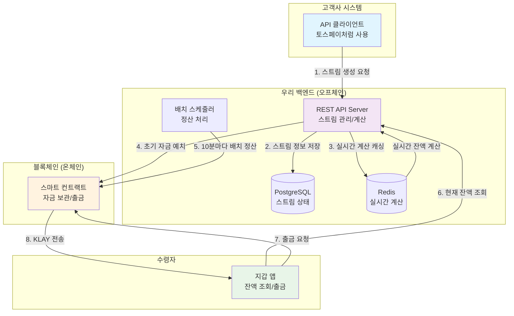
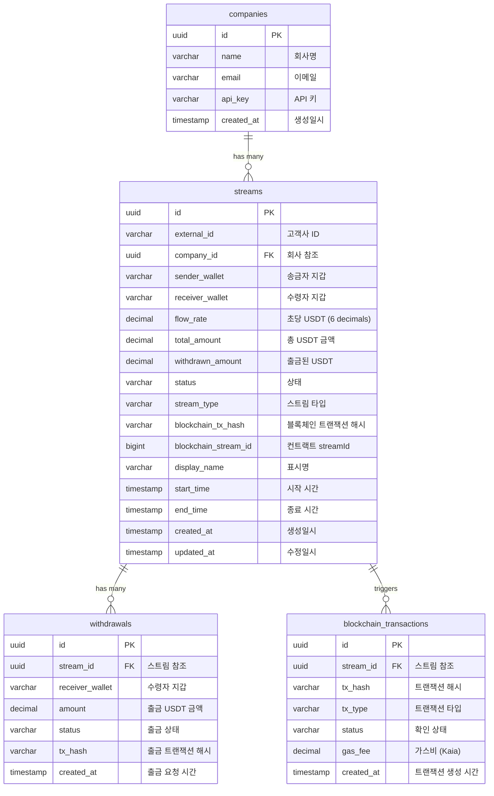

# 머니 스트리밍 API 모듈


## 프로젝트 개요

### 목표
**Kaia Native USDT 기반 DeFi 머니 스트리밍 프로토콜**
- 고객사가 복잡한 블록체인 지식 없이도 "USDT 머니 스트리밍" 기능을 API로 쉽게 붙일 수 있는 모듈
- **Kaia Native USDT**를 활용한 혁신적인 실시간 결제 프로토콜 구현
- Yield Generation, 담보 대출 등 DeFi 기능 통합

### 비즈니스 모델
- **계약건별 수수료**: 계약 생성당 0.5% + 고정비
- **API 이용료**: Basic/Pro/Enterprise 플랜

### 어떻게 할까..
- **백엔드**: 핵심 API 모듈만 구현 (복잡한 마이크로서비스 X)
- **프론트엔드**: 데모용 대시보드 (간단하게)
- **스마트 컨트랙트**: 최소한의 컨트랙트

---

## 핵심 개념 이해

### 머니 스트리밍이란?

**전통적인 계약 방식의 문제점:**
- 프로젝트 완료 후 일괄 지급 → 수주업체 자금 부족
- 급여는 월말에만 지급 → 직원들 생활비 부족
- 구독료는 월 선결제 → 실제 사용량과 무관

**머니 스트리밍 해결책:**
- 매초마다 작업한 만큼 돈이 쌓임 → 언제든 출금 가능
- 실제 사용한 만큼만 결제 → 공정한 거래
- 블록체인 기반 → 투명하고 자동화

```
전통적인 방식:
월 1일 ──────────────────── 월 30일 ──────────────────── 다음달 1일
        (작업중... 돈 없음)            (300만원 일시지급)

스트리밍 방식:
월 1일 ●●●●●●●●●●●●●●●●●●●●●●●●●●●●●● 월 30일
      ↓ ↓ ↓ ↓ ↓ ↓ ↓ ↓ ↓ ↓ ↓ ↓ ↓ ↓ ↓ ↓
      매초 10원씩 자동 적립 → 언제든 출금 가능
```

### 용어 정리 (쉽게 이해하기)

| 용어 | 쉬운 설명 | 실생활 예시 |
|------|-----------|-------------|
| **Flow Rate<br/>(흐름 속도)** | 1초마다 얼마씩 돈이 흐를지 정하는 속도<br/>• 계산: 총 금액 ÷ 총 기간(초) | • 월 300만원 급여 = 초당 1.16원<br/>• 90일 900만원 프로젝트 = 초당 1.16원<br/>• 1 KLAY = 10¹⁸ wei (매우 작은 단위) |
| **Stream<br/>(돈의 흐름)** | 송금자에서 수령자로 지속적으로 흐르는 돈의 강물<br/>• 시작/끝 시점 설정 가능<br/>• 중간에 일시정지/재개 가능 | • 회사 → 직원 (급여 스트림)<br/>• 클라이언트 → 개발자 (프로젝트 스트림)<br/>• 구독자 → 크리에이터 (후원 스트림) |
| **Deposit<br/>(예치금)** | 스트림을 시작하기 위해 미리 맡겨두는 돈<br/>• 총 지급할 금액 + 플랫폼 수수료 0.5%<br/>• 한번 예치하면 자동으로 흘러감 | • 3개월 급여 스트림 → 900만원 + 수수료<br/>• 부족하면 스트림 자동 중단<br/>• 남은 금액은 나중에 회수 가능 |
| **Settlement<br/>(정산/출금)** | 지금까지 쌓인 돈을 실제로 내 지갑으로 빼는 것<br/>• 언제든 가능 (24시간)<br/>• 가스비만 내면 즉시 출금 | • 10일 일한 급여 = 100만원 출금<br/>• 50% 완성된 프로젝트 = 450만원 출금<br/>• 1주일 구독료 = 7만원 출금 |
| **Buffer<br/>(안전장치)** | 스트림이 갑자기 중단되지 않도록 여유분<br/>• 보통 7일치 정도<br/>• 예치금 부족할 때 경고 역할 | • 월급 300만원이면 70만원 정도 여유분<br/>• 부족해지면 알림 발송<br/>• 완전 고갈 전에 충전 가능 |

### 실제 사용 시나리오

**시나리오 1: 프리랜서 개발자 천씨 (프로젝트 계약)**
```
배경: Kaia Native USDT로 계약 투명성과 실시간 정산 구현
1. 클라이언트가 3개월 $9,000 USDT 웹사이트 개발 프로젝트 의뢰
2. 스마트 컨트랙트에 9,045 USDT 예치 (수수료 0.5% 포함)
3. 매초마다 0.00116 USDT씩 자동 적립 (24시간 실시간)
4. 천씨는 1주일 후 210 USDT, 1달 후 3,000 USDT 언제든 출금 가능
5. 예치금은 Aave 등에서 추가 수익 창출 (연 5% APY)
💡 파급효과: 프리랜서 시장 활성화 + DeFi 수익 창출
```

**시나리오 2: 스타트업 직원 진씨 (실시간 급여)**
```
배경: 전통 급여이체에서 USDT 실시간 스트리밍 급여로 전환
1. 회사가 월 $3,000 USDT 급여 스트림 설정
2. 매월 초 3,015 USDT 예치 (수수료 포함)
3. 진씨는 매일 100 USDT씩 실시간 적립 확인 가능
4. 긴급자금 필요시 즉시 출금 (기존 급여일 대기 불필요)
5. 받지 않은 급여를 담보로 즉시 대출 가능 (LTV 70%)
💡 파급효과: 직원 금융 유연성 향상 + 담보 대출 기능
```

**시나리오 3: 유튜버 이씨 (크리에이터 후원)**
```
배경: 플랫폼 수수료 30% → 0.5%로 대폭 절감
1. 구독자 1000명이 각자 월 $10 USDT씩 후원 설정
2. 총 10,000 USDT가 스마트 컨트랙트에 예치
3. 이씨는 매일 333 USDT씩 실시간 수령 (기존 월말 정산 탈피)
4. 플랫폼 수수료 절감으로 크리에이터 실수령액 29.5% 증가
5. 미수령 USDT는 자동으로 Compound에서 이자 생성
💡 파급효과: 크리에이터 이코노미 성장 + 자동 수익 창출
```

**시나리오 4: 넷플릭스 결 대리 (구독 서비스)**
```
배경: 정액제에서 실사용량 기반 USDT 과금으로 전환
1. 넷플릭스 구독료를 사용한 만큼만 USDT로 결제
2. 18 USDT 예치, 시청 1시간당 0.85 USDT 차감
3. 월 10시간 시청시 8.5 USDT만 결제 (50% 절약)
4. 남은 잔액은 즉시 환불 또는 다음달 이월
5. 잔액은 자동으로 Yearn Finance에서 최적 수익 창출
💡 파급효과: 소비자 만족도 향상 + DeFi 수익 최적화
```

**시나리오 5: 스타트업 투자자 최씨 (배당 분배) (증권업 연계)**
```
배경: 토큰증권(STO)과 연계한 실시간 수익 분배
1. 스타트업이 월 매출 1억원 중 10%를 투자자 배당
2. 최씨 지분 5% → 월 50만원 KRW-C 배당
3. 매출 발생 즉시 스마트 컨트랙트로 자동 분배
4. 투명한 수익 공유로 투자 신뢰도 향상
5. 증권사 토큰증권 플랫폼과 시너지 (NICE 긍정 전망)
💡 파급효과: 스타트업 투자 활성화, 자본시장 민주화
```

**시나리오 6: 배달 라이더 정씨 (시간당 임금)**
```
배경: 주급/월급에서 실시간 일당제로 전환
1. 배달앱이 시간당 15,000 KRW-C 스트림 설정
2. "근무 시작" 누르면 초단위 임금 적립 시작
3. 4시간 근무 = 6만원 즉시 확인 및 출금 가능
4. 날씨/시간대별 할증 자동 적용 (투명한 임금 체계)
5. 저축은행 예금 유출 압력 증가 (NICE 부정적 영향)
💡 파급효과: 노동자 경제 안정성 확보, 플랫폼 노동 보호
```

**시나리오 7: SaaS 회사 (사용량 기반 과금)**
```
배경: 클라우드 서비스 Over-billing 문제 해결
1. 고객사가 월 100만 KRW-C 예치
2. API 호출당 10원, 스토리지 GB당 500원 실시간 차감
3. 실사용량 투명 공개로 과금 분쟁 제로
4. 중소기업도 부담 없는 종량제 클라우드 이용
5. AWS/Azure 대비 30% 저렴한 실사용 과금
💡 파급효과: IT 인프라 민주화, 스타트업 성장 지원
```

**시나리오 8: 전월세 보증금 스트리밍**
```
배경: 높은 전세금 부담 완화 및 임대차 분쟁 예방
1. 전세 2억원을 2년간 매월 스트리밍으로 분할 적립
2. 세입자는 매월 833만원씩 KRW-C로 자동 적립
3. 임대인은 매월 일정 금액 수령하며 현금흐름 개선
4. 스마트 컨트랙트로 보증금 보호 및 자동 반환
5. 전세 사기 원천 차단, 부동산 시장 안정화
💡 파급효과: 주거 안정성 향상, 전세 제도 현대화
```

**시나리오 9: 대학 등록금 분할납부**
```
배경: 학자금 부담 완화 및 교육 기회 확대
1. 학기당 400만원 등록금을 6개월 스트리밍 납부
2. 매월 66.7만원씩 KRW-C 자동 납부
3. 학업 성적 연계 장학금 실시간 차감 적용
4. 중도 휴학시 정확한 일할 계산 환불
5. 학자금 대출 의존도 감소
💡 파급효과: 교육 접근성 향상, 학생 경제 부담 완화
```

**시나리오 10: 의료비 분할 결제**
```
배경: 고액 의료비 부담 완화
1. 수술비 500만원을 3개월 스트리밍 결제
2. 매일 5.5만원씩 KRW-C 자동 납부
3. 보험금 수령시 잔액 자동 정산
4. 의료기관 즉시 수납으로 미수금 감소
5. 환자 치료 접근성 대폭 개선
💡 파급효과: 의료 형평성 개선, 건강보험 보완
```

**시나리오 11: 탄소배출권 거래**
```
배경: ESG 경영 및 탄소중립 실현
1. 기업간 탄소배출권을 실시간 KRW-C로 거래
2. 초과 배출시 자동으로 배출권 구매 스트림 활성화
3. 일일 배출량에 따라 실시간 비용 차감
4. 투명한 탄소 회계로 그린워싱 방지
5. 중소기업도 참여 가능한 탄소시장 조성
💡 파급효과: 탄소중립 가속화, 녹색금융 활성화
```

---

### 한국 스테이블코인 도입 영향 분석 (NICE 신용평가 기반)

**금융업권별 예상 영향도**
```
은행: 매우 부정적
   - 예금 이탈 20-30% 예상
   - 대출 여력 감소로 수익성 악화
   - 원화 스테이블코인 발행 참여로 일부 완화 가능

카드사: 중립적  
   - 체크카드 수수료 수익 10% 수준으로 영향 제한적
   - 스테이블코인 지갑 서비스로 신사업 기회

증권사: 긍정적
   - 토큰증권(STO) 시장 선점 기회
   - 디지털 자산 수탁 서비스 신규 수익원

저축은행: 부정적
   - 소액 예금 이탈 압력 상승
   - 조달금리 상승으로 마진 압박
```

**산업별 변화 전망**
```
수혜 산업
   - IT/스타트업: 자금 유동성 개선
   - 크리에이터: 수수료 절감으로 수익 증대  
   - 프리랜서: 즉시 정산으로 현금흐름 개선

영향 산업
   - 전통 금융: 중개 수익 감소
   - PG/VAN: 결제 중개 역할 축소
   - 핀테크: 스테이블코인 기반 서비스 전환 필요
```

### 주요 사용 사례

1. **프로젝트 계약**: 개발/디자인 프로젝트 진행도별 대금 지급
2. **구독 서비스**: 사용량 기반 실시간 과금
3. **급여 시스템**: 실시간 급여 (우리 모듈의 한 가지 활용법)
4. **투자 배당**: 수익 발생시 실시간 배분
5. **크리에이터 후원**: 콘텐츠 소비량별 실시간 정산

---

## Architecture 설계

### 시스템 아키텍처 (오프체인 + 온체인)



### 백엔드 vs 스마트 컨트랙트 역할 분담

| 구분 | 백엔드 (오프체인) | 스마트 컨트랙트 (온체인) |
|------|------------------|-------------------------|
| **주요 역할** | • 스트림 관리 및 실시간 계산<br/>• API 제공 및 인증<br/>• 복잡한 비즈니스 로직 처리 | • 자금 보관 및 출금<br/>• 최종 정산 및 배치 처리<br/>• 탈중앙화된 신뢰 보장 |
| **처리하는 데이터** | • 스트림 생성/수정/삭제<br/>• 실시간 잔액 계산<br/>• 사용자 인증 및 권한 관리 | • 예치금 관리<br/>• 출금 처리<br/>• 배치 정산 기록 |
| **업데이트 빈도** | • 실시간 (매초)<br/>• API 호출시마다 | • 배치 (10분마다)<br/>• 출금 요청시에만 |
| **장점** | • 빠른 응답 속도<br/>• 복잡한 로직 처리 가능<br/>• 가스비 없음 | • 신뢰성 보장<br/>• 탈중앙화<br/>• 검증 가능 |
| **단점** | • 중앙화된 신뢰 필요<br/>• 서버 다운 위험 | • 가스비 발생<br/>• 느린 처리 속도 |

### 오프체인 처리 방식

**1. 실시간 계산은 백엔드에서**
```javascript
// 매초마다 Redis에서 실시간 계산을 한다던지..?
function calculateCurrentBalance(streamId) {
  const stream = getStreamFromCache(streamId);
  const currentTime = Date.now();
  const elapsedSeconds = (currentTime - stream.lastUpdate) / 1000;
  const additionalAmount = stream.flowRate * elapsedSeconds;
  
  return stream.lastBalance + additionalAmount;
}
```

**2. 배치로 블록체인 정산**
```javascript
// 10분마다 실행되는 배치 작업
async function batchSettlement() {
  const activeStreams = await getActiveStreams();
  
  for (const stream of activeStreams) {
    const calculatedBalance = calculateCurrentBalance(stream.id);
    
    // 블록체인에 배치로 업데이트
    await contract.updateStreamBalance(
      stream.externalId, 
      calculatedBalance
    );
  }
}
```

**3. 사용자는 언제든 출금 가능**
```javascript
// 사용자가 출금 버튼 클릭시
async function withdraw(userWallet) {
  // 1. 백엔드에서 현재 출금 가능 금액 계산
  const withdrawableAmount = await calculateWithdrawableAmount(userWallet);
  
  // 2. 스마트 컨트랙트에서 즉시 출금 처리
  await contract.withdraw(userWallet, withdrawableAmount);
}
```

## DB

### PostgreSQL 스키마 (필수 테이블만)

```sql
-- 회사 테이블
CREATE TABLE companies (
    id UUID PRIMARY KEY DEFAULT gen_random_uuid(),
    name VARCHAR(255) NOT NULL,
    email VARCHAR(255) UNIQUE NOT NULL,
    api_key VARCHAR(64) UNIQUE NOT NULL,
    created_at TIMESTAMP DEFAULT NOW()
);

-- 스트림 메인 테이블
CREATE TABLE streams (
    id UUID PRIMARY KEY DEFAULT gen_random_uuid(),
    external_id VARCHAR(255) NOT NULL,
    company_id UUID NOT NULL REFERENCES companies(id),
    
    -- 지갑 주소
    sender_wallet VARCHAR(42) NOT NULL,
    receiver_wallet VARCHAR(42) NOT NULL,
    
    -- USDT 금액 (6 decimals)
    flow_rate DECIMAL(18,6) NOT NULL,
    total_amount DECIMAL(20,6) NOT NULL,
    withdrawn_amount DECIMAL(20,6) DEFAULT 0,
    
    -- 상태
    status VARCHAR(20) DEFAULT 'created',
    stream_type VARCHAR(20) DEFAULT 'project',
    
    -- 블록체인
    blockchain_tx_hash VARCHAR(66),
    blockchain_stream_id BIGINT,
    
    -- 기본 정보
    display_name VARCHAR(255),
    start_time TIMESTAMP,
    end_time TIMESTAMP,
    created_at TIMESTAMP DEFAULT NOW(),
    updated_at TIMESTAMP DEFAULT NOW(),
    
    UNIQUE(company_id, external_id)
);

-- 출금 기록
CREATE TABLE withdrawals (
    id UUID PRIMARY KEY DEFAULT gen_random_uuid(),
    stream_id UUID NOT NULL REFERENCES streams(id),
    receiver_wallet VARCHAR(42) NOT NULL,
    amount DECIMAL(20,6) NOT NULL,
    status VARCHAR(20) DEFAULT 'pending',
    tx_hash VARCHAR(66),
    created_at TIMESTAMP DEFAULT NOW()
);

-- 블록체인 트랜잭션
CREATE TABLE blockchain_transactions (
    id UUID PRIMARY KEY DEFAULT gen_random_uuid(),
    stream_id UUID REFERENCES streams(id),
    tx_hash VARCHAR(66) NOT NULL,
    tx_type VARCHAR(50) NOT NULL,
    status VARCHAR(20) DEFAULT 'pending',
    gas_fee DECIMAL(18,18),
    created_at TIMESTAMP DEFAULT NOW()
);
```

### ERD (Entity Relationship Diagram)



---

## API 명세 (상세 설명)

### 백엔드 API가 필요한 이유

**1. 블록체인의 한계 극복**
- 스마트 컨트랙트는 복잡한 비즈니스 로직 처리 어려움
- 가스비 때문에 실시간 업데이트 불가능
- 사용자 인증, 권한 관리 등 웹2 기능 필요

**2. 사용자 경험 개선**
- 빠른 API 응답 (블록체인 대기시간 없음)
- 실시간 계산 결과 제공
- 토스페이/아임포트와 유사한 개발자 경험

**3. 비즈니스 확장성**
- 다양한 스트림 타입 지원
- 복잡한 수수료 정책 적용
- 고객사별 맞춤 기능 제공

### 주요 API 상세 명세

#### 1. 스트림 생성 API

```http
POST /api/v1/streams
Authorization: Bearer {company_api_key}
Content-Type: application/json
```

**목적**: 새로운 머니 스트림을 생성하고 블록체인에 자금을 예치

**처리 과정**:
1. API 키 검증 및 회사 정보 확인
2. 스트림 정보 DB 저장 (PostgreSQL)
3. 실시간 계산용 캐시 설정 (Redis)
4. 블록체인에 자금 예치 트랜잭션 실행

**Request Body:**
```json
{
  "external_id": "project_alpha_2024_01",      // 고객사에서 관리하는 고유 ID
  "sender_wallet": "0x1234...12345678",        // 자금 송금자 지갑 주소
  "receiver_wallet": "0xfedcba...fedcba09",    // 자금 수령자 지갑 주소  
  "total_amount": "9000.000000",               // 총 USDT 금액 (6 decimals)
  "duration_in_seconds": 7776000,              // 스트림 지속 시간 (초단위, 90일)
  "stream_type": "project",                    // 스트림 유형
  "display_name": "알파 프로젝트 개발비",         // 화면 표시명
  "description": "2024년 알파 프로젝트 개발 계약", // 상세 설명
  "start_time": "2024-02-01T00:00:00Z"         // 스트림 시작 시각 (옵션)
}
```

**Response:**
```json
{
  "success": true,
  "data": {
    "stream_id": "550e8400-e29b-41d4-a716-446655440000",
    "external_id": "project_alpha_2024_01",
    "status": "created",                        // created -> pending -> active
    "flow_rate": "0.001157",                   // 초당 USDT (6 decimals)
    "total_amount": "9000.000000",             // 총 USDT 금액
    "blockchain_stream_id": null,              // 스마트 컨트랙트 streamId (pending시 null)
    "blockchain_tx_hash": null,                // 블록체인 트랜잭션 해시 (pending시 null)
    "created_at": "2024-01-15T14:30:00Z",
    "estimated_completion": "2024-01-15T14:32:00Z" // 블록체인 처리 완료 예상 시간
  },
  "message": "USDT 스트림 생성 요청이 처리되었습니다. 블록체인 트랜잭션 완료까지 약 2분 소요됩니다."
}
```

**에러 응답:**
```json
{
  "success": false,
  "error": {
    "code": "INSUFFICIENT_BALANCE",
    "message": "송금자 지갑의 USDT 잔액이 부족합니다.",
    "details": {
      "required_amount": "9045.000000",
      "current_balance": "5000.000000"
    }
  }
}
```

#### 2. 실시간 스트림 상태 조회 API

```http
GET /api/v1/streams/{stream_id}
Authorization: Bearer {company_api_key}
```

**목적**: 스트림의 현재 상태와 실시간 계산된 잔액 정보 조회

**처리 과정**:
1. Redis 캐시나 DB에서 실시간 잔액 계산
2. DB에서 스트림 기본 정보 조회
3. 블록체인 동기화 상태 확인
4. 통합된 응답 데이터 반환

**Response:**
```json
{
   "success": true,
   "data": {
      "stream_id": "550e8400-e29b-41d4-a716-446655440000",
      "external_id": "project_alpha_2024_01",
      "status": "active",                         // active: 정상 스트리밍 중
      "stream_type": "project",
      "sender_wallet": "0x1234...",
      "receiver_wallet": "0xfedcba...",
      "flow_rate_per_second": "1157407407407",

      // 실시간 계산 데이터 (백엔드에서 매초 계산)
      "current_balance": {
         "total_streamed": "1500.000000",              // 생성부터 현재까지 누적 USDT
         "withdrawable_now": "1500.000000",            // 지금 출금 가능한 USDT
         "remaining_deposit": "7500.000000",           // 예치금 잔여 USDT
         "last_updated": "2024-01-25T10:30:45Z"       // 마지막 계산 시각
      },

      // 시간 정보
      "timeline": {
         "start_time": "2024-02-01T00:00:00Z",
         "end_time": "2024-04-30T23:59:59Z",
         "elapsed_seconds": 2073645,                     // 경과 시간
         "remaining_seconds": 5702355,                   // 남은 시간
         "progress_percentage": 26.67                    // 진행률
      },

      // 블록체인 상태
      "blockchain_status": {
         "last_settlement": "2024-01-25T10:20:00Z",     // 마지막 배치 정산 시각
         "next_settlement": "2024-01-25T10:30:00Z",     // 다음 정산 예정 시각  
         "blockchain_stream_id": 12345,                 // 스마트 컨트랙트 streamId
         "on_chain_balance": "1450.000000",             // 블록체인상 확정 잔액 USDT
         "pending_amount": "50.000000"                  // 정산 대기 중인 USDT
      },

      "created_at": "2024-01-15T14:30:00Z",
      "blockchain_tx_hash": "0xabc123def456..."
   }
}
```

#### 3. 스트림 목록 조회 API (페이징)

```http
GET /api/v1/streams?type=project&status=active&limit=20&offset=0&sort=created_at:desc
Authorization: Bearer {company_api_key}
```

**목적**: 회사별 스트림 목록을 필터링/정렬/페이징하여 조회

**Query Parameters:**
- `type`: 스트림 유형 (project, salary, subscription, dividend, donation)
- `status`: 상태 필터 (active, paused, completed, failed)
- `limit`: 페이지 크기 (기본 20, 최대 100)
- `offset`: 페이지 오프셋
- `sort`: 정렬 기준 (created_at, total_amount, status)
- `search`: 검색어 (display_name, external_id에서 검색)

**Response:**
```json
{
   "success": true,
   "data": {
      "streams": [
         {
            "stream_id": "uuid-1",
            "external_id": "project_alpha_2024_01",
            "display_name": "알파 프로젝트 개발비",
            "stream_type": "project",
            "status": "active",
            "sender_wallet": "0x1234...",
            "receiver_wallet": "0xfedcba...",
            "total_amount": "9000.000000",
            "current_streamed": "2400.000000", // 현재까지 스트리밍된 USDT
            "progress_percentage": 26.67,
            "created_at": "2024-01-15T14:30:00Z",
            "estimated_completion": "2024-04-30T23:59:59Z"
         }
      ],
      "pagination": {
         "total": 45,           // 전체 스트림 수
         "limit": 20,           // 페이지 크기
         "offset": 0,           // 현재 오프셋  
         "has_next": true,      // 다음 페이지 존재 여부
         "has_prev": false      // 이전 페이지 존재 여부
      },
      "summary": {
         "total_active": 23,    // 활성 스트림 수
         "total_volume": "450000.000000", // 총 USDT 거래량
         "monthly_fee": "2250.000000"     // 이번달 USDT 수수료 수익
      }
   }
}
```

#### 4. 스트림 제어 API

```http
POST /api/v1/streams/{stream_id}/pause
Authorization: Bearer {company_api_key}
Content-Type: application/json
```

**목적**: 활성 스트림을 일시정지하여 자금 흐름 중단

**Request Body:**
```json
{
   "reason": "예산 검토 필요",                    // 일시정지 사유
   "pause_duration": 86400,                      // 일시정지 기간(초, 옵션)
   "auto_resume": true                           // 자동 재개 여부
}
```

**Response:**
```json
{
   "success": true,
   "data": {
      "stream_id": "uuid-here",
      "status": "paused",
      "paused_at": "2024-01-25T15:30:00Z",
      "pause_reason": "예산 검토 필요",
      "streamed_until_pause": "2400.000000", // 일시정지 시점까지 스트리밍된 USDT
      "auto_resume_at": "2024-01-26T15:30:00Z"    // 자동 재개 예정 시각
   },
   "message": "스트림이 일시정지되었습니다. 일시정지 시점까지의 금액은 출금 가능합니다."
}
```

#### 5. 출금 가능 금액 조회 API

```http
GET /api/v1/wallets/{wallet_address}/withdrawable
```

**목적**: 특정 지갑 주소의 총 출금 가능 금액 조회 (여러 스트림 합산)

**Response:**
```json
{
   "success": true,
   "data": {
      "wallet_address": "0xfedcba0987654321fedcba0987654321fedcba09",
      "total_withdrawable": "3500.000000",   // 총 출금 가능한 USDT
      "streams": [
         {
            "stream_id": "uuid-1",
            "external_id": "project_alpha_2024_01",
            "stream_type": "project",
            "withdrawable_amount": "1500.000000",
            "last_withdrawal": "2024-01-20T10:00:00Z"
         },
         {
            "stream_id": "uuid-2",
            "external_id": "salary_jan_2024",
            "stream_type": "salary",
            "withdrawable_amount": "2000.000000",
            "last_withdrawal": "2024-01-24T18:30:00Z"
         }
      ],
      "withdrawal_info": {
         "gas_estimate": "21000",                        // 예상 가스 사용량
         "gas_price": "25000000000",                     // 현재 가스 가격 (wei)
         "estimated_fee": "0.000525",                   // 예상 출금 수수료 (Kaia)
         "min_withdrawal": "0.100000"                   // 최소 출금 USDT
      }
   }
}
```

---

## 배포 및 운영

# 일단 온프레미스 배포로 진행

---

## 체크리스트

### MVP (Minimum Viable Product) 기능

#### 백엔드
- [ ] 기본 Nest.js / SpringBoot (Node 기반 백엔드 추천) 서버 셋업
- [ ] PostgreSQL 데이터베이스 연결
- [ ] API 키 인증 미들웨어
- [ ] 스트림 생성/조회/제어 API
- [ ] Kaia 블록체인 연결

#### 스마트 컨트랙트
- [ ] 자체 머니 스트리밍 컨트랙트 작성
- [ ] Hardhat으로 로컬 테스트 작성 및 실행
- [ ] Kaia 테스트넷에 컨트랙트 배포
- [ ] 기본적인 스트림 생성/종료/출금 기능

#### 프론트엔드 (데모용)
- [ ] 다양한 스트림 타입 생성 인터페이스
- [ ] 실시간 스트리밍 현황 대시보드
- [ ] 계약별 수수료 현황

### Demo Day 준비

#### 발표용 시나리오
1. **문제 제시**: 기존 결제/계약의 한계 (완료 후 일괄 지급)
2. **솔루션 소개**: 실시간 머니 스트리밍 API 플랫폼
3. **다양한 활용 사례**:
   - 프로젝트 진행도별 대금 지급
   - 구독 서비스 사용량 과금
   - 실시간 급여 (우리 모듈의 한 활용법)
   - 크리에이터 후원
4. **라이브 데모**:
   - 다양한 타입의 스트림 생성
   - 실시간 잔액 변화 보여주기
   - 계약별 수수료 정산
5. **기술적 우수성**: Kaia 기반 자체 스트리밍 프로토콜
6. **비즈니스 모델**: 계약건별 수수료 기반 SaaS

#### 데모용 데이터 준비
```javascript
// scripts/seed-demo-data.js
const demoData = {
   companies: [
      { name: "테크 스타트업", email: "demo@techstartup.com" },
      { name: "크리에이터 플랫폼", email: "demo@creator.com" }
   ],
   streams: [
      {
         external_id: "demo_project_001",
         display_name: "웹사이트 개발 프로젝트",
         stream_type: "project",
         sender_wallet: "0x...",
         receiver_wallet: "0x...",
         flow_rate_per_day: "100000"
      },
      {
         external_id: "demo_salary_001",
         display_name: "김개발자 실시간 급여",
         stream_type: "salary",
         sender_wallet: "0x...",
         receiver_wallet: "0x...",
         flow_rate_per_day: "100000"
      }
   ]
};
```

### 추가 구현 가능 기능 (Nice to Have)
- [ ] 이메일/SMS 알림
- [ ] API 사용량 대시보드
- [ ] 스트림 템플릿 기능
- [ ] 다중 토큰 지원
- [ ] 거래 내역 엑셀 다운로드
- [ ] 스트림 타입별 분석 차트

---

**해커톤 화이팅!**
