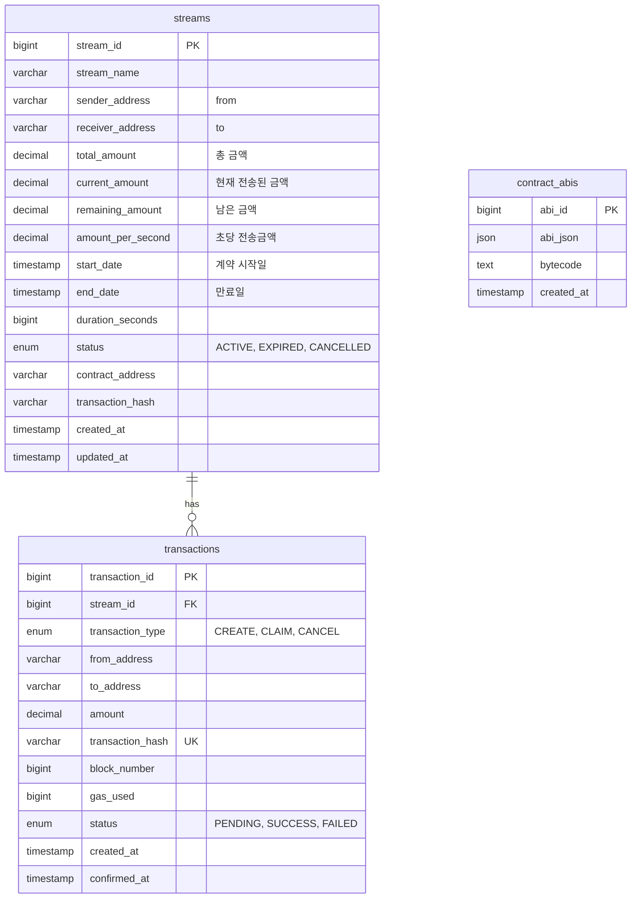

# 머니 스트리밍 DApp 화면 정의서

## 1. 로그인 페이지
- **지갑 로그인** 기능 제공 (Kaia 지갑 연동)

---

## 2. 마이페이지
1. **주소**
2. **잔액 조회**
   - 카이아 / USDT
   - 컨트랙트에서 실시간 조회
3. **스트림 생성 버튼**
4. **보낸 계약 목록 (송신 스트림)**
5. **받은 계약 목록 (수신 스트림)**
6. **만료된 계약 목록**
   - 계약 리스트 항목:
     - 생성 스트림명
     - 남은 금액
     - 총 금액
7. **민트 기능**

---

## 3. 계약 생성 페이지
1. To (수신자 주소)
2. From (송신자 주소)
3. 스트림명
4. Account (계정/지갑 정보)
5. Duration (기간)
6. 컨트랙트 객체 서명을 위한 **ABI, Bytecode** 제공 API 필요

---

## 4. 계약 상세 페이지
1. 스트림명
2. 계약 날짜 (시작일 ~ 만료일)
3. 송신자 → 수신자
4. 현재 전송된 금액
5. 총 금액 (납부해야 할 총액)
6. 남은 금액
7. 상태값 (Status)  
   - ACTIVE  
   - EXPIRED  
   - CANCELED
8. 초당 전송 금액
9. 종료 버튼

---

## 5. Mint 페이지
1. 민팅 API (최대 100개 지원)

---

## 테이블 설명

### 1. **streams** (스트림 계약)
- 모든 스트리밍 페이먼트 계약 정보
- 보내는 사람(from), 받는 사람(to) 주소
- 금액 관련: 총금액, 현재 전송된 금액, 남은 금액
- 초당 전송금액 자동 계산
- 상태: ACTIVE(진행중), EXPIRED(만료), CANCELLED(종료)

### 2. **transactions** (트랜잭션 기록)
- 스트림 관련 모든 블록체인 트랜잭션 추적
- 유형: CREATE(생성), CLAIM(출금), CANCEL(종료)
- 트랜잭션 상태: PENDING(대기중), SUCCESS(성공), FAILED(실패)
- 가스비 및 블록 정보 기록

### 3. **contract_abis** (컨트랙트 정보)
- 계약 생성시 필요한 ABI와 바이트코드
- API로 프론트엔드에 제공

---
